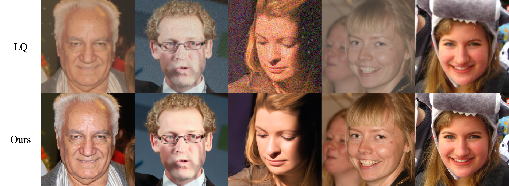

# Old Portrait Photo Restoration Based on Selective State Space Model

<p align="center">
  A fidelity-oriented restoration framework for old portrait photographs, built upon
  VMamba.
</p>

<p align="center">
  
</p>

## Overview

Old portrait photographs often contain mixed and spatially varying degradations, including fading, blur, noise, compression artifacts, scratches, and color shifts. This project adapts MambaIRv2 to this restoration setting while prioritizing facial structure and identity fidelity.

- **Portrait-domain fine-tuning** with controlled compound degradation.
- **Face parsing-guided prior** that assigns higher importance to perceptually critical facial regions.
- **Weighted spatial domain combined with frequency domain supervision strategy**
- **High-Frequency Enhancement Block (HFEB)** for lightweight feature-space refinement.

## Installation
This codebase was tested with the following environment configurations. It may work with other versions.

- Ubuntu 20.04
- CUDA 11.7
- Python 3.9
- PyTorch 2.0.1 + cu117

(Note: If you uses a newer cuda version, say 12.x, you may refer to the official github page of `causal_conv_1d` and `mamba_ssm` to find a matched version.) 

The following give three possible solution to install the mamba-related libraries.

### Previous installation
To use the selective scan with efficient hard-ware design, the mamba_ssm library is needed to install with the folllowing command.
```
pip install causal_conv1d==1.0.0
pip install mamba_ssm==1.0.1
```
One can also create a new anaconda environment, and then install necessary python libraries with this requirement.txt and the following command:
```
conda install --yes --file requirements.txt
```
### Backup installation
If you encounter difficulties installing `causal_conv1d` or `mamba_ssm`, e.g. the network can't link to github, it's recommended to use an offline whl install.
## Results
The paired dataset is constructed from FFHQ portraits using a controlled synthetic degradation pipeline.

|  | PSNR ↑ | SSIM ↑ | LPIPS ↓ | ID-Sim ↑ | Params |
|---|---:|---:|---:|---:|---:|
| Input | 22.77 | 0.61 | 0.41 | 0.876 | – |
| **Ours** | **30.35** | **0.87** | **0.22** | **0.954** | **22.65M** |


## Acknowledgements

This project is developed based on [MambaIRv2](https://github.com/csguoh/MambaIR) and [BasicSR](https://github.com/XPixelGroup/BasicSR).